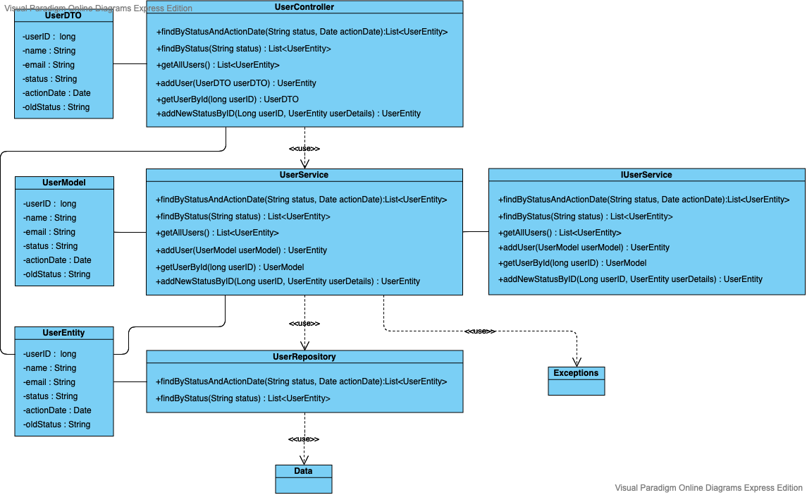
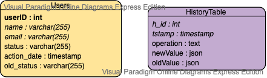

# NexignServerAPI

Задание [(здесь)](https://yadi.sk/i/Ce13lEoIvoEQIg)

Цель задания:
Познакомиться с базовыми концепциями фреймворка SpringBoot, на примере разработки сервера API (JSON HTTP API)

## Проектирование 

### Диаграмма классов(Class Diagram)

### Диаграмма связей(ER Diagram)

(в данном задании таблица HistoryTable не использовалась)
